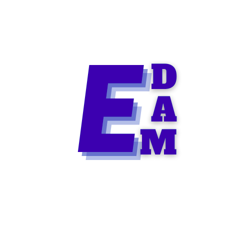
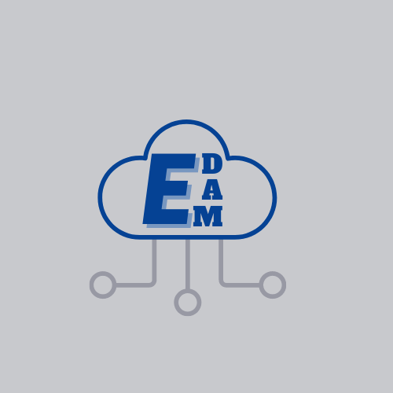
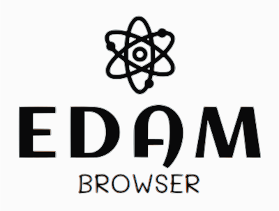

# EDAM logoi
Various suggestions of _logoi_ for EDAM and related tools.

**Please feel welcome to contribute more, the EDAM community appreciates it!** 🙏🏽😸

The best way is to fork this repo, add a **new file** (ideally **SVG** 🚝) with a new or improved suggestion, and create a pull request.

Legal stuff: By creating a pull request, you are sharing your design under the CC BY-SA 4.0 license, while maintaining the authorship of your design. If you're re-using someone else's work in your design, please make sure that you follow the terms of its license (_e.g._ attributing the original authors).

### [@edamontology](https://github.com/edamontology/edamontology)
<table>
<tr>
<td></td>
<td></td>
<td></td>
</tr>
</table>

### [@pooja2299](https://github.com/pooja2299)
<table>
<tr>
<td></td>
<td></td>
<td></td>
</tr>
<tr>
<td></td>
<td></td>
<td></td>
</tr>
</table>

### [@raashika03](https://github.com/raashika03)
<table>
<tr>
<td></td>
<td></td>
<td></td>
</tr>
<tr>
<tr>
<td></td>
<td></td>
<td></td>
</tr>
</table>

### [@tawahpeggy](https://github.com/tawahpeggy)
<table>
<tr>
<td></td>
<td></td>
<td></td>
</tr>
<tr>
<td></td>
<td></td>
<td></td>
</tr>
</table>

### [@Chiamaka-Uzuegbu](https://github.com/Chiamaka-Uzuegbu)
<table>
<tr>
<td></td>
<td></td>
<td></td>
</tr>
<tr>
<td></td>
<td></td>
<td></td>
</tr>
<tr>
<td></td>
<td></td>
<td></td>
</tr>
</table>

### [@bryan-brancotte](https://github.com/bryan-brancotte)
<table>
<tr>
<td></td>
<td></td>
<td></td>
</tr>
<tr>
<td></td>
<td></td>
<td></td>
</tr>
</table>
